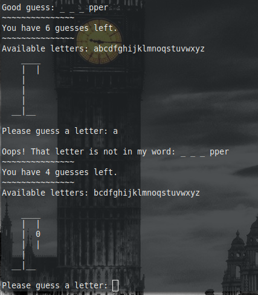

# Hangman

An interactive game of Hangman for the command terminal.

How to play:

At the start of the game, a word (secret_word) is chosen for the player to
guess, one letter at a time. Each guessed letter is recorded and the
remaining letters are displayed at the start of each guessing round.

Each game starts with six guesses.

During each guessing round, the guess is evaluated (invalid, incorrect, or
correct) and each correcly guessed letter is revealed. If a guess is
invalid (not an alpha character or more than one character*) or if it has
already been guessed (within each game), the player is penalized by losing
a warning. Once there are no warnings left, a guess will be lost instead.
See warning_penalty() for details.

*There is one exception to this rule. See Hints below.

For each valid (i.e. single alpha character), but incorrect letter guessed
(i.e. not in the word), the player will lose:
    *   one guess for all consonants
    *   two guesses for vowels ("y" is not a vowel for the purposes of this
        game).
See guess_penalty() for details.

The game is over once all guesses have been lost or all letters in the word
have been guessed. If the game is won, a score will be returned (see
total_score() for details).

Hints:
*   Entering an asterisk (*) as the guess returns a list of all possible
    matches in the wordlist based on the currently guesses word.
    See match_with_gaps(), show_possible_matches(), and get_guessed_word()
    for details.
*   Entering an asterisk + a percent-sign (*%) as the guess will return a
    list of all letters that comprise the possible match words returned by
    entering *, but with the addition of the percentage of each letters
    representation in the overall count of letters.

It's important to note that the words returned by * and the stats returned
by *% will be comprised of ALL words in the wordlist that are possible
matches based on the value of guessed_word. This does NOT take into
remove any correct or incorrect letters already guessed, so take the hints
with caution.
